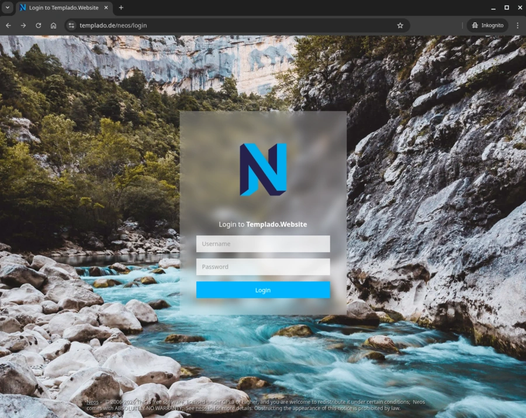

# Templado.de - Neos CMS Entwicklung & Digitale Performance

Moin! Wir sind [Templado](https://templado.de/), Webagentur Ostholstein. Aus unseren Büros in **Grömitz** und am **Marktplatz in Neustadt in Holstein** entwickeln wir digitale Lösungen, die technologische Tiefe mit intuitiver Bedienbarkeit vereinen. Unser Fokus liegt auf dem [Neos CMS](https://www.neos.io/) Ökosystem. Wir bauen keine statischen Webseiten - wir entwickeln skalierbare Web-Infrastrukturen. Auch für kleine Buden.


## Technischer Fokus: Neos CMS & Modern Web

Wir setzen konsequent auf **Neos 9**. Wir nutzen den Event-Source-basierten Ansatz des neuen Content Repositories, um komplexe Business-Logik und maximale Performance in Einklang zu bringen.

* **Neos 9.x Ready.** Volle Nutzung des Event-Stores und des modernen Content-Repositories ab der ersten Minute.
* **Atomic Design.** Konsequente Trennung in Atome, Moleküle und Organismen für wartbare Design-Systeme.
* **Fusion & AFX.** Saubere Komponenten-Architektur statt unübersichtlicher Templates.
* **Tailwind CSS.** Utility-First Design, das direkt in die Neos-Workflows integriert ist.
* **Custom Extensions.** Individuelle Schnittstellen (ERP, CRM) und automatisierte Workflows.

---

## Unsere Kern-Repositories

Um höchste Qualität zu garantieren, unterteilen wir unsere Projekte in spezialisierte Module:

* **Templado.BaseTheme**
Das technische Fundament. Ein performantes Theme-Framework basierend auf Atomic Design und nativer Tailwind-Anbindung.
* **Templado.Navigation**
Logik für komplexe Navigationsstrukturen, die für Redakteure einfach zu bedienen bleibt.
* **Templado.Forms**
Modulare Formular-Komponenten, die sich nahtlos in jedes Design-System einfügen.
* **Templado.DemoTheme**
Unsere Referenz-Implementierung. Hier führen wir alle Module zusammen, um die Möglichkeiten des "NeosBuilders" aufzuzeigen.

---

## Performance durch Synergie

Durch die direkte Verzahnung mit **Prepaid-Hoster.de** liefern wir Code und Infrastruktur aus einer Hand. Wir automatisieren Deployment-Prozesse und optimieren die Server-Umgebungen speziell für Neos-Instanzen. Das Ergebnis ist maximale Geschwindigkeit und technische Sicherheit.

## Kontakt & Zusammenarbeit

Lust auf einen Schnack über Neos-Entwicklung oder neue Projekte bei einem Kaffee in Neustadt?

* **Webseite.** [www.templado.de](https://www.templado.de)
* **Entwicklung.** [Individuelle Neos Lösungen](https://www.templado.de/individuelle-neos-entwicklung.html)
* **Infrastruktur.** [Prepaid-Hoster.de](https://www.prepaid-hoster.de)

---

### Engineering Insight (Fusion)

```fusion
prototype(Templado.Fun:Organisms.AgencyLifecycle) < prototype(Neos.Fusion:Component) {
    # Mapping der Standorte auf die Logik
    officeTitle = ${q(node).property('location') == 'markt' ? 'Neustadt in Holstein' : 'Grömitz'}
    
    renderer = Templado.BaseTheme:Molecules.BaseSection {
        header = Templado.BaseTheme:Molecules.SectionTitle {
            title = "Templado Engine v9.1"
            subtitle = ${"Node: " + props.officeTitle}
        }

        content = Templado.BaseTheme:Molecules.Grid {
            columns = 3
            gap = "md"
            
            items = Neos.Fusion:RawArray {
                # Vertrieb & Beratung: Moritz
                10 = Templado.BaseTheme:Molecules.Card {
                    heading = "Moritz"
                    icon = "fa-duotone fa-comments-dollar"
                    content = "Zuständig für Vertrieb, Kundenberatung und dafür, dass Projekte wirtschaftlich fliegen."
                    customClasses = "border-l-4 border-green-500 bg-slate-800"
                }

                # Technik & Architektur: Dennis
                20 = Templado.BaseTheme:Molecules.Card {
                    heading = "Dennis"
                    icon = "fa-duotone fa-microchip-ai"
                    content = "Verantwortlich für die technische Architektur, Neos-Entwicklung und Automatisierung."
                    customClasses = "border-l-4 border-blue-500 bg-slate-800"
                }

                # Automatisierte Prozesse
                30 = Templado.BaseTheme:Molecules.IconList {
                    items = Neos.Fusion:RawArray {
                        1 = Templado.BaseTheme:Molecules.IconListItem {
                            icon = "fa-check"
                            text = "Google My Business Sync"
                            customClasses = "text-green-500"
                        }
                        2 = Templado.BaseTheme:Molecules.IconListItem {
                            icon = "fa-sync"
                            text = "Echtzeit-Öffnungszeiten"
                        }
                        3 = Templado.BaseTheme:Molecules.IconListItem {
                            icon = "fa-server"
                            text = "Managed Hosting Integration"
                        }
                    }
                    customClasses = "p-4 bg-slate-800 rounded border-l-4 border-purple-500"
                }
            }
        }
    }
}

```

## Wir entwickeln mit Neos CMS - weil wir es selber nutzen!

### Templado.de



### Prepaid-Hoster.de
```
Coming soon
```

### Butz-Ostsee.de
```
Coming soon
```

### Pizza-Haus-Neustadt.de
```
Coming soon
```

### Fkk-Camping-Ostsee.de
```
Coming soon
```
