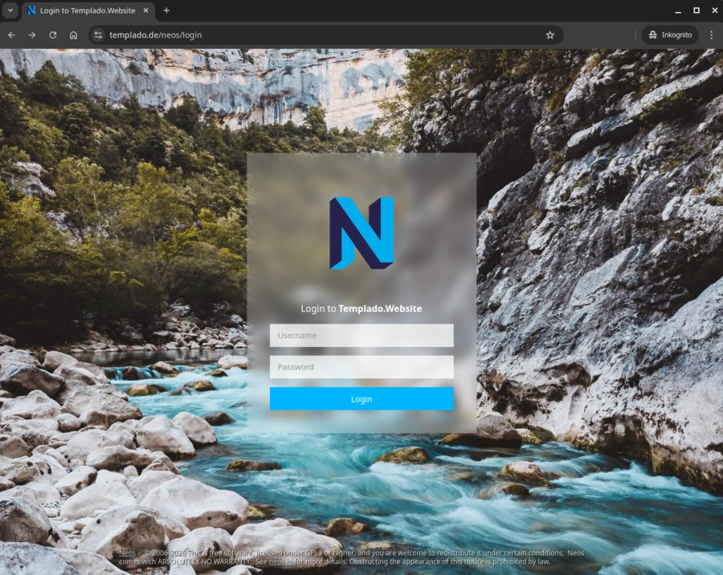

# Templado.de - Neos CMS & Laravel Entwicklung

Moin! 

Wir sind [Templado](https://templado.de/), Webagentur Ostholstein. Aus unseren Büros in **Grömitz** und am **Marktplatz in Neustadt in Holstein** entwickeln wir digitale Lösungen, die technologische Tiefe mit intuitiver Bedienbarkeit vereinen. Unser Fokus liegt im Frontend-Bereich auf dem [Neos CMS](https://www.neos.io/) Ökosystem. Für komplexere Backends (oder Brücken) greifen wir auf Laravel zurück. Wir bauen keine WordPress Webseiten - wir entwickeln Software.


## Technischer Fokus: Neos CMS & Modern Web

Wir setzen konsequent auf **Neos 9**. Wir nutzen den Event-Source-basierten Ansatz des neuen Content Repositories, um komplexe Business-Logik und maximale Performance in Einklang zu bringen.

* **Neos 9.x Ready.** Volle Nutzung des Event-Stores und des modernen Content-Repositories ab der ersten Minute.
* **Atomic Design.** Konsequente Trennung in Atome, Moleküle und Organismen für wartbare Design-Systeme.
* **Fusion & AFX.** Saubere Komponenten-Architektur statt unübersichtlicher Templates.
* **Tailwind CSS.** Utility-First Design, das direkt in die Neos-Workflows integriert ist.
* **Custom Extensions.** Individuelle Schnittstellen (ERP, CRM) und automatisierte Workflows.

## Ansonsten: Laravel ist die Antwort auf alles
Während Neos unsere erste Wahl für Content-Management ist, bildet Laravel das Rückgrat für alles andere. Ob komplexe Web-Applikationen, API-Schnittstellen oder unsere eigenen Plattformen wie [Vionity](https://www.prepaid-hoster.de/info/vionity.html) - wir setzen auf das Laravel-Ökosystem für maximale Skalierbarkeit.

---

## Wozu GitHub?
Wir nutzen GitHub zur internen Verwaltung und Distribution unserer Module. Durch jahrelange Erfahrung in Neos-Projekten haben wir wiederkehrende Aufgaben identifiziert und in Modulen abstrahiert. So verlieren wir keine Zeit mit repetitivem Bootstrapping, sondern konzentrieren uns auf die individuelle Logik jedes Projekts.

* **Templado.BaseTheme**: Das technische Fundament. Ein performantes Theme-Framework basierend auf Atomic Design und nativer Tailwind-Anbindung.
* **Templado.Navigation**: Logik für komplexe Navigationsstrukturen, die für Redakteure einfach zu bedienen bleibt.
* **Templado.Forms**: Modulare Formular-Komponenten, die sich nahtlos in jedes Design-System einfügen.
* **Neos Instance Manager**: Node-basiertes Webinterface für Neos CMS Bootstrapping per SSH. Installiert automatisch Templado-Pakete und konfiguriert das Basis-Theme. 

\[... wird fortlaufend erweitert]

---

## Performance durch Synergie

Durch die direkte Verzahnung mit **Prepaid-Hoster.de** liefern wir Code und Infrastruktur aus einer Hand. Wir automatisieren Deployment-Prozesse und optimieren die Server-Umgebungen speziell für Neos-Instanzen. Das Ergebnis ist maximale Geschwindigkeit und technische Sicherheit.

## Kontakt & Zusammenarbeit

Lust auf einen Schnack über Neos-Entwicklung oder neue Projekte bei einem Kaffee in Neustadt?

* **Webseite.** [www.templado.de](https://www.templado.de)
* **Entwicklung.** [Individuelle Neos Lösungen](https://www.templado.de/individuelle-neos-entwicklung.html)
* **Infrastruktur.** [Prepaid-Hoster.de](https://www.prepaid-hoster.de)

---

### Engineering Insight (Fusion)

```fusion
prototype(Templado.Quest:BaseElement.TempladoContribution) < prototype(Neos.Neos:ContentComponent) {
        headingLevel = 'h2'
        href = 'https://www.templado.de'
        headingContent = "Umsetzung und Gestaltung"
        templadoLogoUrl = "https://www.templado.de/logos/templado-logo-black.png"
        headingClasses = ""
        renderer = Neos.Fusion:Tag {
                tagName = 'div'
                content = Neos.Fusion:Join {
                        item_1 = Neos.Fusion:Tag {
                                tagName = ${props.headingLevel}
                                attributes.class = ${props.headingClasses || "font-bold text-2xl"}
                                content = ${props.headingContent}
                        }
                        item_3 = Neos.Fusion:Tag {
                                tagName = 'p'
                                content = Neos.Fusion:Tag {
                                        tagName = 'a'
                                        attributes.href = ${props.href}
                                        content = Neos.Fusion:Tag {
                                                tagName = 'img'
                                                attributes.src = ${props.templadoLogoUrl}
                                                attributes.alt = 'Templado Logo'
                                                attributes.style = Neos.Fusion:Join {
                                                        @glue = ';'
                                                        item_1 = 'display: inline-block'
                                                        item_2 = 'width: 240px'
                                                        item_3 = 'margin: 0.5rem 0'
                                                }
                                                attributes.title = 'Templado.de Webagentur Ostholstein'
                                                selfClosingTag = true
                                        }
                                }
                        }
                        item_2 = Neos.Fusion:Tag {
                                tagName = 'p'
                                content = Neos.Fusion:Tag {
                                        tagName = 'a'
                                        attributes.href = ${props.href}
                                        attributes.style = 'text-decoration: underline; color: #000;'
                                        attributes.target = '_blank'
                                        content = 'www.Templado.de'
                                }
                        }
                        item_4 = Neos.Fusion:Tag {
                                tagName = 'p'
                                content = Neos.Fusion:Join {
                                        item_1 = Neos.Fusion:Tag {
                                                tagName = "strong"
                                                attributes.class = "inline-block text-lg"
                                                content = 'Templado &middot; Webagentur Ostholstein'
                                        }
                                        item_2 = Neos.Fusion:Tag {
                                                tagName = 'br'
                                                selfClosingTag = true
                                        }
                                        item_3 = 'Cloud Center GmbH'
                                        item_4 = Neos.Fusion:Tag {
                                                tagName = 'br'
                                                selfClosingTag = true
                                        }
                                        item_5 = 'Kurpromenade 48'
                                        item_6 = Neos.Fusion:Tag {
                                                tagName = 'br'
                                                selfClosingTag = true
                                        }
                                        item_7 = '23743 Grömitz'
                                }
                        }
                }
        }
}
```

## Wir entwickeln mit Neos CMS - weil wir es selber nutzen!

### Templado.de



### Prepaid-Hoster.de
```
Coming soon
```

### Butz-Ostsee.de
```
Coming soon
```

### Pizza-Haus-Neustadt.de
```
Coming soon
```

### Fkk-Camping-Ostsee.de
```
Coming soon
```
